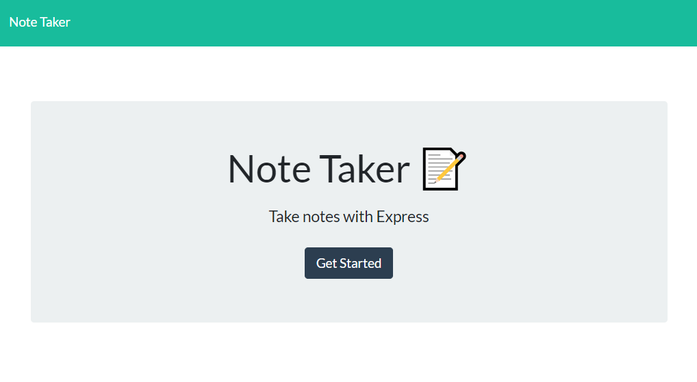
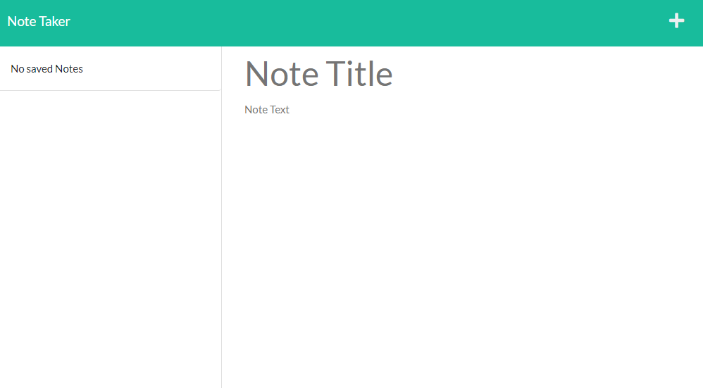
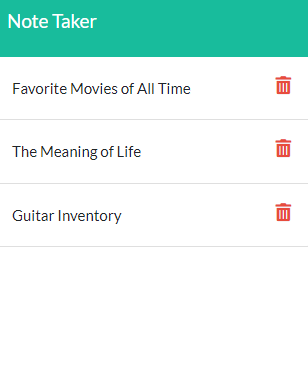
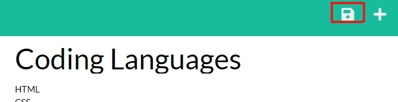

# 📝 Homework #9: Note-Taker

📌 [Link to Deployed Application](https://awidener3-note-taker.herokuapp.com/)

## 🔨 Task
Given pre-written front-end code, I need to utilize NodeJS with the Express package to create back-end routes and add CRUD methods to those routes. The app will also be deployed to Heroku.

## 📎 How to Use
Follow [this link](https://awidener3-note-taker.herokuapp.com/) to be taken to the Note Taker app, hosted on Heroku. Enter the application by clicking the **Get Started** button at the center of the screen. From here, you will be taken to `notes.html` where you will see any saved notes populated on the left nav. On the right, you can either view a saved note (by clicking on it on the side nav) or you can create a new one by clicking the **+** on the top right of the screen, or filling out your text and clicking the 💾 on the top right of the screen.

You are also able to delete any note you want by clicking the red trashcan to the right of the note in the side nav.

All notes are saved to a database, so all notes can be retrieved anywhere!

## 🔍 Preview


## 📷 Screenshots
Clicking on the `Get Started` button initializes the app and takes you to the main notes page.


The notes page has a side nav on the left where saved notes are kept. The right side of the screen is a text area for creating new notes, or viewing old ones. The plus on the top right is for adding a note. 


The side navbar displays any saved notes you may have. Clicking a note displays its contents in the text area. The red trash can deletes the note from the database.



The text area can either contain the contents of a stored note, of if you click on `Note Title` or `Note Text`, you can add information to create a new note.


Once the `Note Title` and `Note Text` inputs have been filled in, a save button will appear in the top right that allows you to save the note.



## User Story

```md
AS A small business owner
I WANT to be able to write and save notes
SO THAT I can organize my thoughts and keep track of tasks I need to complete
```

## Acceptance Criteria

```md
GIVEN a note-taking application
WHEN I open the Note Taker
THEN I am presented with a landing page with a link to a notes page
WHEN I click on the link to the notes page
THEN I am presented with a page with existing notes listed in the left-hand column, plus empty fields to enter a new note title and the note’s text in the right-hand column
WHEN I enter a new note title and the note’s text
THEN a Save icon appears in the navigation at the top of the page
WHEN I click on the Save icon
THEN the new note I have entered is saved and appears in the left-hand column with the other existing notes
WHEN I click on an existing note in the list in the left-hand column
THEN that note appears in the right-hand column
WHEN I click on the Write icon in the navigation at the top of the page
THEN I am presented with empty fields to enter a new note title and the note’s text in the right-hand column
```